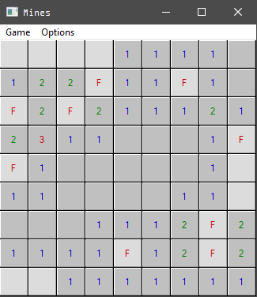
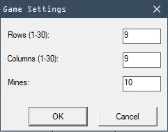
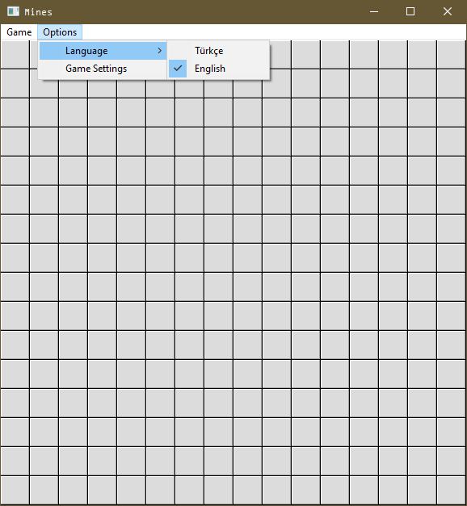

# C-Win32-Minesweeper-GUI

Low-level Win32 GUI Minesweeper implementation in C. Demonstrates manual message handling (`WM_COMMAND`, `WM_DRAWITEM`), control subclassing for right-click flagging, owner-draw rendering, recursive flood-fill reveal logic, Unicode support, and 64-bit compatibility. Built with MinGW (x86_64).

---

## Mines

A clean, single-file Minesweeper written from scratch in C using the Win32 API.  
No dependencies, no installer — just compile and run.


---

## Screenshots



<details>
<summary>Options & Language</summary>

<br>

<table align="center"><tr>
<td align="center" valign="middle"></td>
<td align="center" valign="middle"></td>
</tr></table>

</details>

---

## Features

- Fully resizable and maximizable window — cells scale dynamically to fit
- Grid centers with black margins when window is larger than the grid (Win7 Minesweeper style)
- Bilingual UI: **English / Turkish**, persisted across sessions via the Windows registry
- Configurable grid size (1–30 × 1–30) and mine count via the Options menu
- Classic Minesweeper digit colors (blue, green, red…)
- Right-click flagging via `WM_RBUTTONUP` subclassing
- Recursive flood-fill reveal for empty cells
- Settings saved to `HKCU\Software\MinesGame`

---

## Build

**On Linux (cross-compile):**
```bash
x86_64-w64-mingw32-gcc mines.c -o mines.exe -municode -mwindows
```

**On Windows (MinGW):**
```bash
gcc mines.c -o mines.exe -municode -mwindows
```

No additional libraries or resource files needed.

---

## Usage

| Action | Input |
|---|---|
| Reveal cell | Left click |
| Place / remove flag | Right click |
| New game | Game → New Game |
| Change language | Options → Language |
| Change grid / mine count | Options → Game Settings |

---

## Implementation Notes

- **Owner-draw buttons** (`BS_OWNERDRAW`) handle all cell rendering via `WM_DRAWITEM`
- **Control subclassing** (`SetWindowLongPtrW` + custom `ButtonProc`) captures right-click events on individual cells
- **`DeferWindowPos`** batch-repositions all buttons on every resize, minimizing flicker
- **`WM_GETMINMAXINFO`** enforces a minimum window size so cells never collapse below 12px
- **`WM_ERASEBKGND`** paints the background black, matching the Win7 Minesweeper aesthetic
- Window is initially sized to fit `COLS × DEF_CELL` pixels, clamped to the OS work area so large grids (e.g. 30×30) never start off-screen
